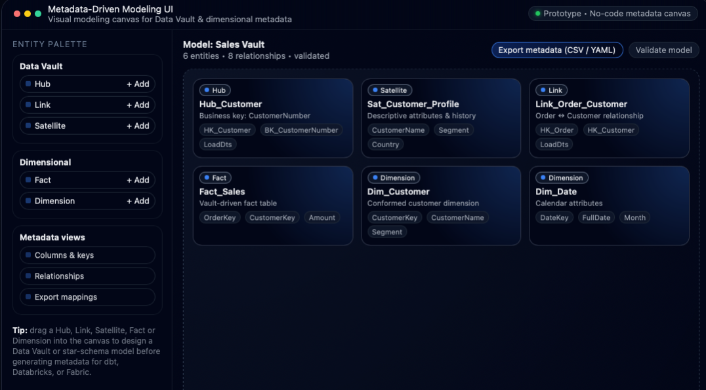

# Metadata-Driven Modeling UI

<p align="center">
  
</p>

A web-based interface for designing and managing metadata structures for **Data Vault** and **dimensional models**.  
This prototype enables users to visually define business entities, relationships, and mappings — generating consistent model metadata for automation frameworks such as **Data Vault Automation Toolkit**, **dbt**, and **Fabric**.


---

## Overview

The **Metadata-Driven Modeling UI** provides a no-code experience for metadata creation and management.  
It bridges the gap between data architects and business users, simplifying how metadata is designed, validated, and exported for automation pipelines.

The interface allows defining:
- **Business entities** (Hubs, Links, Satellites, Facts, and Dimensions)  
- **Relationships and dependencies** between entities  
- **Exports** of metadata as CSV or YAML for dbt or Fabric ingestion  

---

## Architecture

| Layer | Technology |
|--------|-------------|
| Frontend | Next.js + React |
| Styling | Tailwind CSS |
| Backend API | FastAPI (Python) |
| Metadata Storage | PostgreSQL or CSV/YAML export |
| Automation Integration | dbt, Databricks, Microsoft Fabric |
| Optional Auth | Azure AD (OAuth2) |

---

## Key Features

- Visual entity modeling canvas  
- Drag-and-drop relationships between Hubs, Links, and Satellites  
- CSV/YAML metadata export for automation frameworks  
- Two-way sync with the **Data Vault Automation Toolkit**  
- Metadata validation and standard naming enforcement  
- Ready for deployment on Azure App Service or Vercel  

---

## Quick Start (Prototype Mode)

```bash
# Clone repository
git clone https://github.com/incra-ai/metadata-driven-modeling-ui.git
cd metadata-driven-modeling-ui

# Install dependencies
npm install

# Start development server
npm run dev
```


